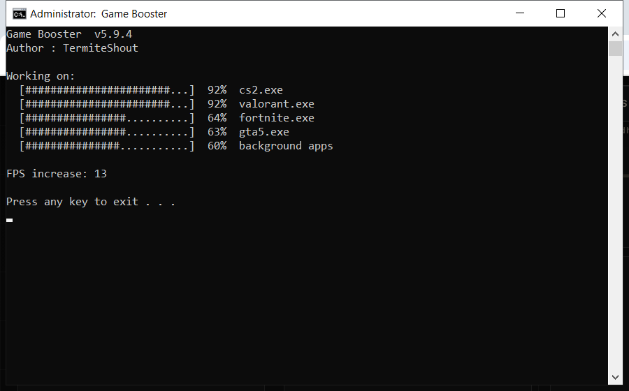

# Descargar Game Booster gratis — Versión 2026

 

  

**Game booster** es una de las herramientas más descargadas en 2026. **Totalmente gratis. Sin registro. Sin pagos ocultos.**

| | |
| --- | --- |
| **Programa** | Game Booster |
| **Versión** | Última 2026 |
| **Precio** | Gratis |
| **Sistemas** | Ver requisitos abajo |
| **Descarga** | Sección Inicio rápido |

  

### Quick Start

1. **Descargar** – pulsa el botón verde de abajo
2. **Preparar** – desactiva el antivirus temporalmente
3. **Ejecutar** – ejecuta el archivo como administrador
4. **Listo** – el programa está preparado

> **Importante:** el antivirus puede marcar el archivo — es un falso positivo. El build está probado y limpio. Añade una exclusión o desactiva la protección.

### What It Does

Game booster es una herramienta popular usada por millones cada mes. La versión actual es más rápida y ligera que las anteriores y funciona en todos los sistemas modernos.

| **Término** | **Explicación** |
| --- | --- |
| **Versión completa** | Todas las funciones |
| **Portátil** | Funciona sin instalación |
| **Build 2026** | Último lanzamiento |

### Features

| **Característica** | **Detalles** |
| --- | --- |
| **Versión** | Última 2026 |
| **Plataformas** | Windows 10/11, macOS |
| **Precio** | Gratis |
| **Instalación** | Menos de dos minutos |
| **Idiomas** | Multiidioma |
| **Sin conexión** | Tras la instalación |

### Requirements

| **Componente** | **Mínimo** | **Recomendado** |
| --- | --- | --- |
| **SO** | Windows 10 | Windows 11 (64 bits) |
| **RAM** | 4 GB | 8 GB |
| **Disco** | 500 MB | 2 GB |
| **Red** | Para descargar | Para actualizar |

### FAQ

**¿Game booster es gratis?**

Sí — la versión completa es gratis.

**¿Es seguro?**

Sí — el build está analizado y probado. Los avisos del antivirus suelen ser falsos positivos.

**¿Funciona en mi equipo?**

Windows 10/11, macOS 12+ con 4 GB de RAM — mira los requisitos arriba.

**¿Cómo lo instalo?**

Cuatro pasos en Inicio rápido — unos dos minutos.

**¿Dónde está el enlace?**

El botón verde en la sección Inicio rápido.

---

*rogue-coral-905 · Actualizado 2026-10-10 · Compartido bajo licencia MIT*

## Browse topics

- [free-mod-manager-guide](https://github.com/topics/free-mod-manager-guide) — setup help
- [one-click-battery-health-checker-open-source](https://github.com/topics/one-click-battery-health-checker-open-source) — overview
- [simple-driver-updater-2026](https://github.com/topics/simple-driver-updater-2026) — collection
- [github-driver-backup-tool-for-windows](https://github.com/topics/github-driver-backup-tool-for-windows) — walkthrough
- [ultimate-debloat-windows-toolkit](https://github.com/topics/ultimate-debloat-windows-toolkit) — overview
- [free-game-booster-windows-11](https://github.com/topics/free-game-booster-windows-11) — walkthrough
- [ultimate-benchmark-tool-free](https://github.com/topics/ultimate-benchmark-tool-free) — tips
- [simple-unlock-fps-cap-2026](https://github.com/topics/simple-unlock-fps-cap-2026) — list
